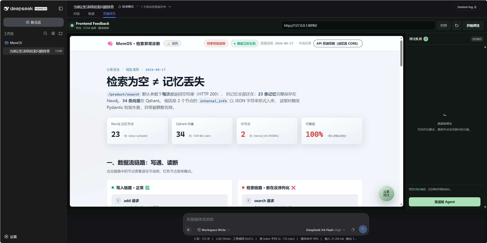

# PageCraft

**English** · [简体中文](./README.zh-CN.md)

Visual feedback and design workbench for frontend agents, built into DeepSeek Harness.

PageCraft 0.4.0 keeps visual intent attached to source-level work: preview a page, select an element or draw a region, capture the active responsive context, and send a structured work order to the Agent that owns the code. It now adds an evidence-based task timeline and contextual editing guidance alongside source hints, screenshot context, visual history, safe recovery, themes, and cinematic-motion requests.

> PageCraft is an independent project. It is not affiliated with or endorsed by OpenAI or Codex.



## What is new in 0.4.0

- **Evidence-based task timeline** — shows batch identity, elapsed time, actual DSH queue position, and observable prepare/locate/edit/verify/finalize stages without invented percentages or ETAs.
- **Contextual editing guidance** — recognizes actions, text, forms, containers, media, and regions, then offers editable drafts that include the selected target, breakpoint, responsive scope, and safety constraints. Suggestions never auto-send or overwrite existing text.
- **Explicit visual outcomes** — completed batches distinguish visible change, no visible change, and unavailable visual verification.
- **Reopen reconciliation** — unfinished local batches reconnect to the current DSH session snapshot when PageCraft is reopened.

The detailed user guide is available in Chinese at [README.progress-guidance.zh-CN.md](./README.progress-guidance.zh-CN.md).

## 0.3.0 features

- **Studio workbench** — a focused preview canvas with breakpoint controls, screenshot capture, visual history, and theme/motion entry points.
- **DOM-to-source evidence** — `SourceHints` collect best-effort React, Vue, Svelte, and explicit `data-pagecraft-*` metadata such as component, owner chain, file, line, stable ID, evidence, and confidence. Hints narrow the search; the Agent must still read and cross-check candidate source before editing.
- **Responsive annotations** — Desktop (1440×900), Laptop (1280×800), Tablet (768×1024), Mobile (390×844), and custom 240–7680 px viewports. Each annotation carries its viewport and one of `current-breakpoint`, `current-and-smaller`, or `all-breakpoints`.
- **Image + text handoff** — PageCraft attempts to attach the current/before screenshot to the structured text work order. If the active model or adapter rejects image input, it retries with text only, retains the screenshot in visual history, and reports the downgrade instead of embedding Base64 in the prompt.
- **Visual history and comparison** — each batch can store before, after, and rollback captures in IndexedDB and show a draggable before/after reveal or side-by-side fallback. History is capped at 50 records, 25 MB total, and 5 MB per snapshot; when IndexedDB is unavailable it falls back to in-memory session history.
- **Safe recovery** — “Restore this batch” sends a `[frontend-rollback]` work order. The builder Skill requires batch-scoped recovery material and post-change hash checks, stops on mismatches, and forbids repository-wide reset/clean operations. Recovery is Agent-executed; PageCraft does not silently overwrite files.
- **Three bundled Skills** — `frontend-design` turns intent into an art-direction brief; `frontend-page-builder` implements and verifies page changes; `presentation-builder` handles browser-based decks.
- **Theme and cinematic work orders** — Studio can request Editorial Light, Product Neutral, Cinema Dark, or extraction of the current design system. It can also request layered depth, scroll reveal, subtle parallax, chapter transitions, spotlight masks, film texture, cinematic grading, or ambient video, with reduced-motion, mobile-fallback, and performance-budget instructions.
- **Secure-by-default preview proxy** — remote and private hosts are denied unless explicitly enabled, with DNS/IP checks, redirect revalidation, origin controls, signed short-lived resource tokens, response limits, timeouts, and concurrency limits.

## Quick start on DeepSeek Harness

The `lxy` branch includes compiled `lib/` output, so a GitHub installation does not require a separate plugin build. From the DeepSeek Harness source directory:

```powershell
pnpm dsh plugin --profile web add github:noabt187/dsh-PageCraft#lxy
pnpm dsh web
```

Open the Harness URL printed in the terminal, select a workspace, and choose **PageCraft** beside the composer controls.

For local development or an uncommitted build, first run `npm run build` in PageCraft, then install its absolute directory:

```powershell
pnpm dsh plugin --profile web add C:\absolute\path\to\dsh-PageCraft
pnpm dsh web
```

Re-run `npm run build` after source changes and refresh/restart Harness so it loads the updated `lib/` bundle.

## Use PageCraft

### Refine a page

1. Start the target frontend and open its local URL in PageCraft, for example `http://localhost:5173`.
2. Choose a Desktop, Laptop, Tablet, Mobile, or custom viewport and select the responsive scope.
3. Use **Select element** for existing UI or **Select area** where new UI should be inserted.
4. Optionally capture a screenshot, write one or more comments, queue them, and choose **Send to Agent**.
5. PageCraft records a before snapshot. When the Agent run completes, it reloads the preview, captures the after state when available, and exposes the batch in **Compare & history**.

Area annotations carry one of three layout intents:

- **Insert** — add content to normal layout flow and move following content.
- **Overlay** — layer content above the current layout without reflowing it.
- **Replace** — replace DOM covered by the selected region.

### Use Studio themes and motion

Open **Themes & motion** from the breakpoint toolbar. A theme or motion choice sends a structured `[frontend-theme]` or `[frontend-motion]` request; it does not paste a canned stylesheet into the page. The bundled Skills tell the Agent to map the request onto the existing design system, preserve behavior and accessibility, provide mobile/reduced-motion fallbacks, and validate the rendered result.

### Compare and recover a batch

Open **Compare & history** to inspect batch state and before/after captures. If recovery is needed, choose **Restore this batch**. The resulting `[frontend-rollback]` request must verify the expected post-change hashes and apply only the reverse patch created for that batch. If files have changed since the batch, recovery reports a conflict instead of overwriting newer work.

### Build and refine a presentation

Switch PageCraft to **Presentation**, create a browser-based deck, and open the preview URL returned by the Agent. PageCraft discovers stable slide IDs and supports the same element, region, source-hint, responsive, screenshot, history, and recovery protocol. Native PPTX/PDF export is not implemented.

## What the Agent receives

PageCraft sends compact JSON work orders under markers such as `[frontend-feedback]`, `[presentation-feedback]`, `[frontend-theme]`, `[frontend-motion]`, and `[frontend-rollback]`. An annotation can include:

```json
{
  "id": 1,
  "type": "element",
  "target": { "selector": ".stats-card" },
  "sourceHints": {
    "framework": "react",
    "component": "StatsCard",
    "owners": ["Dashboard", "StatsGrid", "StatsCard"],
    "file": "src/components/StatsCard.tsx",
    "evidence": ["react-debug-source"],
    "confidence": 0.92
  },
  "viewport": {
    "preset": "mobile",
    "width": 390,
    "height": 844,
    "devicePixelRatio": 2
  },
  "scope": "current-breakpoint",
  "screenshot": {
    "kind": "before",
    "width": 390,
    "height": 844,
    "mimeType": "image/webp"
  },
  "request": "Stack the metrics without changing the desktop layout."
}
```

Screenshot bytes are transported as an image message when supported; only screenshot metadata appears in the JSON prompt. `SourceHints.confidence` is evidence quality, not proof of the source file.

## Security configuration

The bundled profile is intentionally restrictive:

```yaml
- id: frontend-feedback
  name: dsh-frontend-feedback
  config:
    allowRemoteHosts: false
    allowPrivateHosts: false
    allowedHosts: []
    allowedRequestOrigins: []
    maxHtmlBytes: 5242880
    maxResourceBytes: 20971520
    requestTimeoutMs: 15000
    maxConcurrentRequests: 8
    resourceTokenTtlMs: 60000
```

- Loopback targets such as `localhost`, `127.0.0.1`, and `::1` are supported by default.
- Add exact trusted public hosts to `allowedHosts`, or deliberately set `allowRemoteHosts: true` to permit public remote hosts after DNS/IP validation.
- Set `allowPrivateHosts: true` only when LAN preview is required. Metadata, link-local, multicast, documentation, and other restricted ranges remain blocked.
- `allowedRequestOrigins` can restrict preview API callers to explicit Harness origins. When empty, PageCraft still enforces same Harness host/port checks for browser-originated requests.
- `maxConcurrentRequests` limits simultaneous proxy work. `resourceTokenTtlMs` controls signed resource-token lifetime and is bounded by the implementation to 1–300 seconds.
- Host policy and resolved addresses are revalidated across redirects. HTML/resource byte limits and request timeouts remain active.

Only preview pages you trust. Target JavaScript runs in a sandboxed iframe, but PageCraft is primarily intended for local development and controlled pages.

## Local development and checks

```powershell
git clone --branch lxy https://github.com/noabt187/dsh-PageCraft.git
cd dsh-PageCraft
npm install
npm run typecheck
npm run check
```

Available scripts:

- `npm run build` builds the host and browser bundles into `lib/`.
- `npm run typecheck` runs TypeScript with `tsc --noEmit`.
- `npm test` builds and runs the Node test suite.
- `npm run check` runs type checking, the build-backed test suite, and `npm pack --dry-run` package-content validation.

## Limitations

- Screenshot capture uses browser rendering primitives and may fail for cross-origin images/fonts or unsupported SVG `foreignObject`; failures are recorded rather than presented as successful visual evidence.
- Visual comparison proves only what was captured at that URL and viewport. A passing build is not a visual assertion, and an unavailable capture is shown explicitly.
- Safe recovery depends on the Agent having created `.pagecraft/history/<batchId>` recovery material and hashes for the batch. Without valid material, restore must stop.
- Authentication, target-domain cookies, strict CSP, Service Workers, file uploads, POST navigation, and some cross-origin modules may not work in the isolated preview.
- External sites may block embedding, automation, or proxied resources.
- Presentation mode targets interactive HTML/React decks; native PPTX/PDF export is not implemented.
