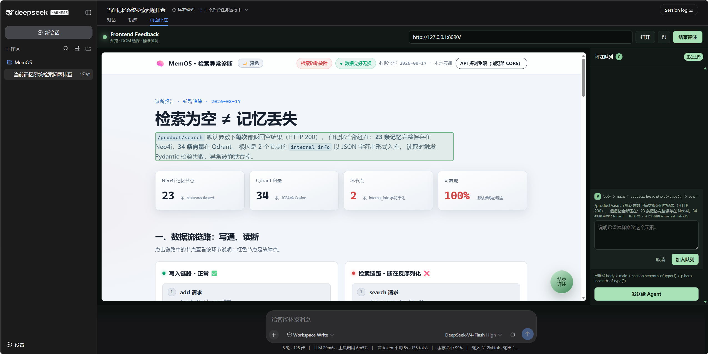
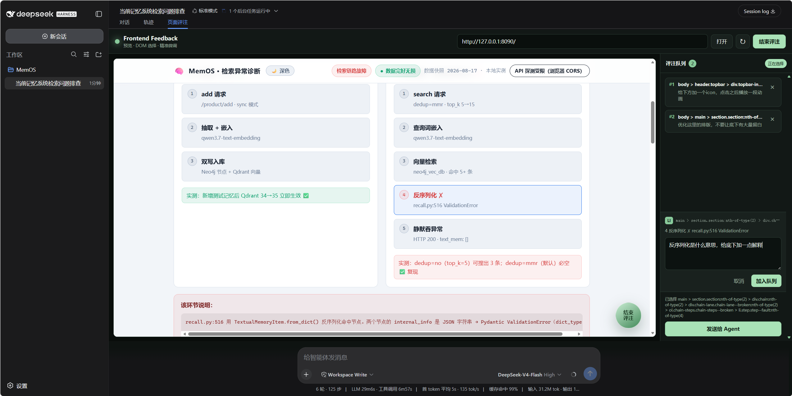

# PageCraft

[English](./README.md) · **简体中文**

集成在 DeepSeek Harness 中的前端可视化评注工具。

PageCraft 把类似 Codex 的可视化评注工作流带到 DeepSeek Harness：打开页面，直接指出需要修改的位置，再把准确的上下文交给负责代码的 Agent。在此基础上，它还增加了可调整的自由框选、多条评注队列、草稿恢复、迷你浏览器和网页演示文稿支持。

> PageCraft 是独立项目，与 OpenAI 或 Codex 不存在隶属或官方合作关系。


## 为什么需要 PageCraft？

当一次前端修改被简化成截图和“把那个卡片往下挪一点”时，关键信息已经丢失。Agent 仍然需要猜测具体元素、所属容器、布局如何变化以及用户所指的位置。

PageCraft 会把这些上下文留在评注里：选择已有 DOM 时采集元素和容器；选择空白区域时记录可调整的矩形及其相对容器坐标；最后把多条要求整理成精简、结构化的工单交给当前 Agent。

## 核心能力

- **直接指出真实界面**：点击渲染后的 DOM，不再依赖截图和模糊描述。
- **描述尚不存在的组件**：在空白位置画框，继续移动、缩放和对齐，再要求 Agent 新增内容。
- **统一修改网页和演示文稿**：普通前端页面与 HTML/React 幻灯片共用一套评注方式。
- **直接使用真实项目目录**：打开当前 Harness 工作区或任意子文件夹，编辑与 VS Code、Agent 完全相同的本地文件，在原目录预览图片、处理冲突并恢复近期版本。
- **不经过 Agent 直接改文字**：点击页面上的文字并输入新内容；PageCraft 自动寻找唯一的本地源码位置、原子写入、刷新页面验证，如果 DOM 没有变化就自动恢复。
- **让演示图片真正持久化**：把图片上传到项目目录，点击生成好的图片槽位，再把图片路径、裁剪方式和焦点写回 `deck.json`。
- **保持连续工作流**：支持前进、后退和刷新；关闭面板或重启 Harness 后仍可恢复网址、选区、评论和队列。
- **提供可直接执行的上下文**：一次发送多条评注，并携带 DOM、布局意图、幻灯片身份及提前计算好的几何信息。
- **使用独立构建 Skill**：`frontend-page-builder` 与 `presentation-builder` 分别约束网页和演示文稿的生成与修改。

| DOM 选择 | 自由框选 | 评注队列 |
| --- | --- | --- |
|  | 在没有 DOM 的位置画框，并移动、缩放和吸附对齐。 |  |

## 快速开始

在 DeepSeek Harness 源码目录中执行：

```powershell
pnpm dsh plugin --profile web add github:noabt187/dsh-PageCraft
pnpm dsh web
```

打开终端输出的 Harness 地址，选择一个工作区，然后点击输入框控件旁的 **PageCraft**。仓库已经包含编译后的 `lib/`，从 GitHub 安装时不需要单独构建插件。

## 使用方式

### 修改前端页面

1. 启动前端项目，在 PageCraft 中打开本地地址，例如 `http://localhost:5173`。
2. 修改已有内容时点击“选择元素”；希望新增内容时点击“框选区域”。
3. 写下一个或多个要求，加入队列后点击“发送给 Agent”。
4. Agent 完成修改后，PageCraft 会重新加载预览，同时保留尚未发送的内容。

如果只是改一段显示文字，可以打开“文件”，点击“选择文字”，再点击页面中的标题或段落并输入新内容。PageCraft 能处理常见的 HTML、React/TSX、Vue、Svelte、Markdown、JSON/i18n 和 PageCraft `deck.json`，整个过程不发送对话，也不消耗模型 token。只有找到一个高置信度源码位置时才会写入；遇到歧义、接口数据、运行时文本或当前文件夹之外的源码时，它会保持文件不变并直接说明原因。

区域评注可以明确选择三种布局意图：

- **插入**：加入正常布局流，并让后续内容自然移动。
- **覆盖**：浮在当前布局上方，不改变原有文档流。
- **替换**：替换选区当前覆盖的 DOM。

### 创建和修改演示文稿

1. 将 PageCraft 切换到“演示文稿”，点击“上传文档生成”。
2. 上传 PDF、DOCX、Markdown、TXT，或直接粘贴资料；填写观众、目标页数和演讲目标。
3. PageCraft 先把内容提取到当前工作区，Agent 只生成一版可以编辑的目录。生成页面前可以调整顺序、修改标题、增加或删除页面。
4. 确认目录后，Agent 按小批次逐页生成。PageCraft 会持久保存任务、显示每页进度，并在预览地址就绪后自动打开。
5. PageCraft 识别渲染后的各张幻灯片，继续使用 DOM 或可调整区域进行逐页评注。
6. 打开“项目图片”，或直接点击预览中的图片槽位，上传 PNG、JPEG、WebP、GIF。可以选择“铺满裁剪”或“完整显示”、调整图片焦点，并把结果保存进项目。
7. 打开“文件”，浏览 PPT 在磁盘上的真实目录结构。在实时预览旁编辑标准 `deck.json`、渲染组件和主题；按 `Ctrl+S` 保存，明确处理 Agent 同时修改造成的冲突，恢复近期版本，或直接修改选中的幻灯片文字。

导入文档、目录和生成状态保存在 `.pagecraft/presentations/`；可编辑的 PPT 源码通常放在 `src/presentation/`，用户图片放在 `public/pagecraft-assets/`。项目根目录中的 `pagecraft-presentation.json` 描述演示数据和受管理图片的位置，但不会重新组织文件管理器；图片始终显示在真实磁盘目录中。相同图片按内容去重；仍被幻灯片引用时不能误删。由于图片引用已经写入项目，PageCraft 小浏览器和普通浏览器标签页会显示同一结果。

## Agent 收到什么？

PageCraft 发送的是精简工单，而不只是一张截图。例如，一条区域评注可以是：

```json
{
  "annotations": [
    {
      "id": 1,
      "type": "area",
      "operation": "insert",
      "target": {
        "container": { "selector": ".dashboard" },
        "position": {
          "x": 24,
          "y": 320,
          "width": 720,
          "height": 180,
          "corners": {
            "topLeft": [24, 320],
            "topRight": [744, 320],
            "bottomRight": [744, 500],
            "bottomLeft": [24, 500]
          }
        }
      },
      "request": "在这里新增统计卡片，并与上方卡片保持对齐。"
    }
  ]
}
```

矩形尺寸和容器偏移在发送前就由插件计算完成。Agent 可以把推理能力用于定位源码和调整布局，而不是重新猜测坐标。

## 工作原理

```text
目标网页
    │
    ▼
Harness 预览代理 ── 加载 HTML 与运行时资源
    │
    ▼
隔离预览 ── DOM 选择、区域调整、幻灯片识别
    │ 结构化评注
    ▼
当前 Agent + 对应 builder Skill
    │
    └──────────────► 修改源码 ► 刷新预览
```

PageCraft 主要由五层组成：

1. **预览层**：Harness 中的迷你浏览器，提供导航和 Host 代理，用于加载本地页面或明确允许的远程页面。
2. **评注层**：注入页面的脚本负责 DOM 命中、可调整矩形、对齐参考线、容器识别和幻灯片信息。
3. **Agent 交接层**：把队列内容转换为 `[frontend-feedback]` 或 `[presentation-feedback]` 工单。
4. **真实工作区层**：以当前 DSH 会话目录为安全边界，保持物理文件树、CodeMirror 编辑器、图片预览、磁盘监听、原子保存、冲突检测和有限历史版本与外部工具同步。
5. **文字修改事务层**：用受限的静态源码分析把 DOM 文字定位到唯一的本地源码范围，只写入最小改动；刷新后验证真实 DOM，失败时按文件哈希安全回滚。演示清单只负责 PPT 数据语义和受管理图片绑定。

## 配置

本机页面始终可用。远程页面可以全部放行，也可以在 Harness profile 中逐个允许：

```yaml
- id: frontend-feedback
  name: dsh-frontend-feedback
  config:
    allowRemoteHosts: false
    allowedHosts:
      - preview.example.com
    maxHtmlBytes: 5242880
    maxResourceBytes: 20971520
    maxPresentationAssetBytes: 20971520
    maxPresentationSourceBytes: 2097152
    maxWorkspaceTextBytes: 2097152
    requestTimeoutMs: 15000
```

只预览你信任的地址。PageCraft 会在隔离 iframe 中运行目标页面脚本，但它仍然主要面向本地开发环境和你能够控制的页面。

## 本地开发

```powershell
git clone https://github.com/noabt187/dsh-PageCraft.git
cd dsh-PageCraft
npm install
npm run check
```

然后在 DeepSeek Harness 源码目录中链接本地插件：

```powershell
pnpm dsh plugin --profile web add <你的-dsh-PageCraft-路径>
pnpm dsh web
```

修改源码后执行 `npm run build` 并刷新 Harness。`npm run check` 会完成构建、自动化测试和包内容检查。

## 已知限制

- PageCraft 最适合本地开发服务和你能够控制的应用。
- 登录状态、目标域 Cookie、严格 CSP、Service Worker、文件上传、POST 跳转及部分跨域模块可能无法在隔离预览中运行。
- 外部网站可能主动限制嵌入、自动化或代理资源。
- 文档导入支持不超过 25 MB 的 PDF、DOCX、Markdown 和 UTF-8 文本；扫描版 PDF 需要 OCR，当前版本会明确拒绝。
- 演示文稿模式目前创建和修改网页式幻灯片；原生 PPTX/PDF 导出和母版编辑属于后续功能。
- 直接修改文字采用保守策略：接口动态数据、运行时计算文本、多个相同字面量、构建产物和当前打开文件夹之外的源码都不会被猜测修改。稳定的 `data-pagecraft-text-key` 能让 PPT 文字定位完全确定，但唯一的静态文字不强制要求该标记。
- 图片槽位管理仍需要标准 PageCraft 演示清单和稳定的 `data-pagecraft-image-key`。旧 PPT 只有在源码位置唯一、结构明确时才能自动迁移。

## 路线图

- 响应式断点评注与多区域编辑。
- 修改前后视觉对比与评注历史。
- 为支持图片理解的模型附加可选区域截图。
- 演示文稿模板、母版布局及 PPTX/PDF 导出。
